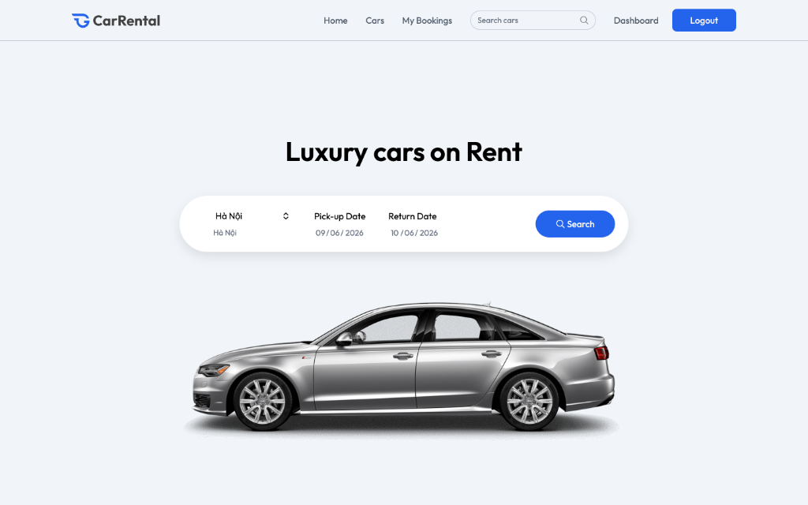
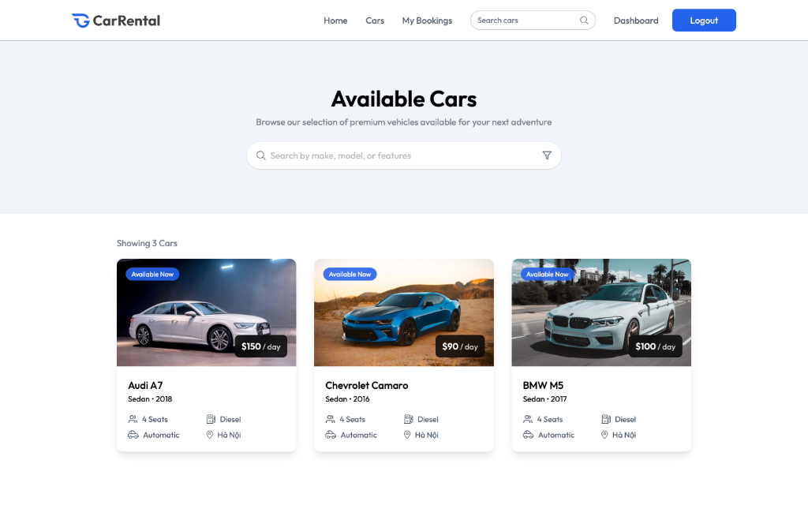
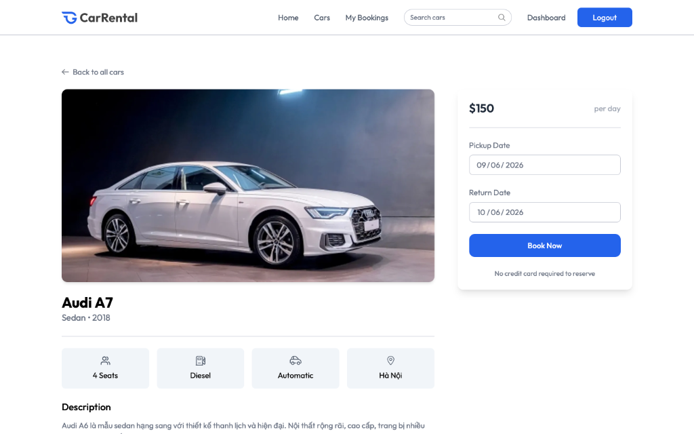
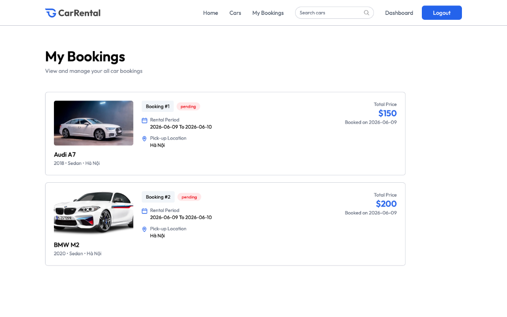
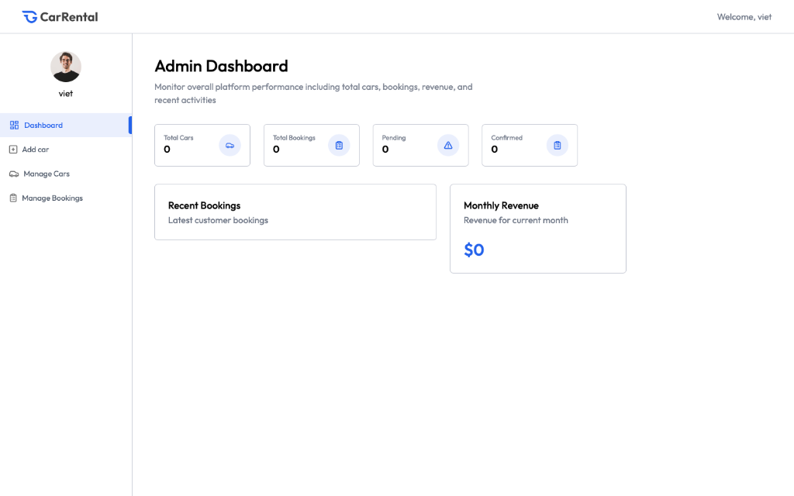
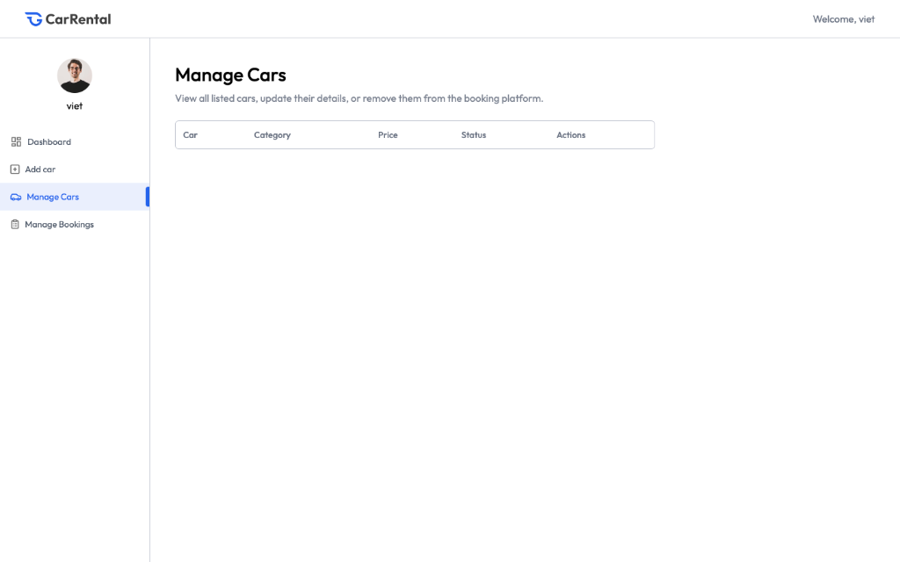
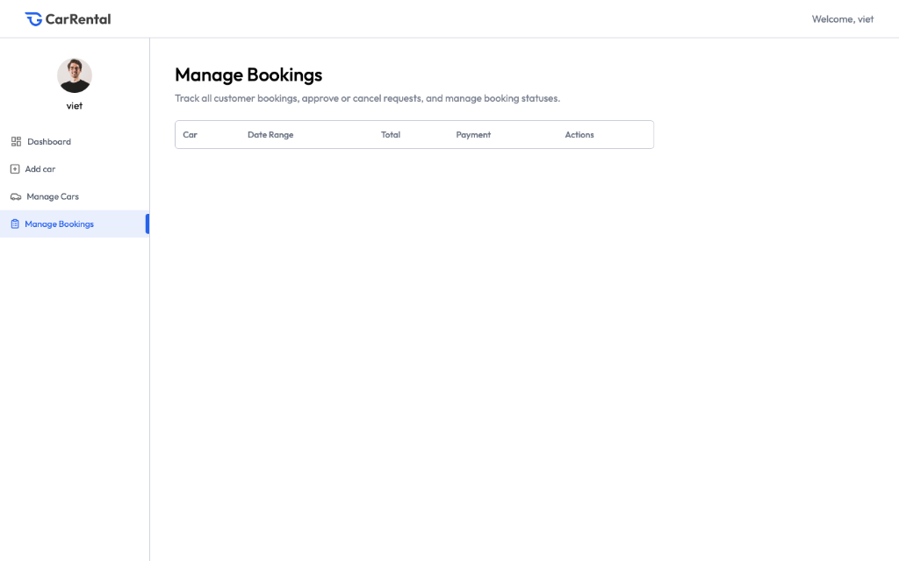

# 🚗 Car Rental - thviet05

> **Nền tảng thuê xe trực tuyến** – Kết nối khách hàng với chủ xe, hỗ trợ đặt xe theo ngày, quản lý đội xe và theo dõi doanh thu theo thời gian thực.

---

## 📌 Mô Tả Dự Án

**Car Rental** là một ứng dụng web full-stack cho phép người dùng tìm kiếm và đặt thuê xe ô tô trực tuyến. Hệ thống hỗ trợ hai vai trò: **Khách hàng** (tìm kiếm, đặt xe, xem lịch sử đặt) và **Chủ xe / Admin** (quản lý xe, duyệt đơn đặt, xem doanh thu dashboard).

Dự án được xây dựng theo mô hình **REST API** với frontend React và backend Express, sử dụng MongoDB Atlas làm cơ sở dữ liệu và ImageKit để lưu trữ hình ảnh xe.

---

## ✨ Tính Năng Chính

### 👤 Phía Khách Hàng
- 🔐 Đăng ký / Đăng nhập tài khoản (JWT Authentication)
- 🏠 Trang chủ với Hero section, Featured section, Testimonials, Newsletter
- 🔍 Tìm kiếm xe theo tên, hãng, tính năng
- 🚘 Xem danh sách xe có sẵn với thông tin chi tiết (giá/ngày, số ghế, nhiên liệu, hộp số, địa điểm)
- 📋 Xem chi tiết xe + đặt xe theo ngày (pickup date, return date)
- 📂 Quản lý lịch sử đặt xe cá nhân (My Bookings)
- 📍 Chọn địa điểm nhận xe (Hà Nội, TP. HCM, Đà Nẵng, ...)

### 🛠️ Phía Chủ Xe / Admin
- 📊 **Dashboard** – Thống kê tổng số xe, tổng đơn đặt, đơn pending, đơn confirmed, doanh thu tháng
- ➕ **Thêm xe** – Upload ảnh lên ImageKit, nhập đầy đủ thông tin xe
- 📋 **Quản lý xe** – Xem danh sách, chỉnh sửa, xoá xe
- 📁 **Quản lý đơn đặt** – Xem và duyệt/từ chối đơn của khách

---

## 🛠️ Công Nghệ Sử Dụng

### Frontend
| Công nghệ | Mô tả |
|---|---|
| **React 19** | Thư viện UI chính |
| **Vite 6** | Build tool & dev server |
| **React Router DOM 7** | Điều hướng client-side |
| **TailwindCSS 4** | Styling framework |
| **Axios** | HTTP client giao tiếp với API |
| **Motion** | Thư viện animation |
| **React Hot Toast** | Thông báo toast UI |

### Backend
| Công nghệ | Mô tả |
|---|---|
| **Node.js** | Runtime môi trường server |
| **Express 5** | Web framework |
| **MongoDB + Mongoose** | Cơ sở dữ liệu NoSQL |
| **JWT (jsonwebtoken)** | Xác thực người dùng |
| **Bcrypt** | Mã hoá mật khẩu |
| **Multer** | Xử lý upload file |
| **ImageKit** | Lưu trữ & quản lý hình ảnh |
| **Dotenv** | Quản lý biến môi trường |
| **Nodemon** | Tự động restart server khi dev |
| **CORS** | Xử lý cross-origin requests |

### Dịch Vụ Ngoài
| Dịch vụ | Mục đích |
|---|---|
| **MongoDB Atlas** | Database cloud |
| **ImageKit.io** | Cloud image storage & CDN |
| **Vercel** | Triển khai ứng dụng |

---

## ⚙️ Hướng Dẫn Cài Đặt

### Yêu Cầu Hệ Thống
- [Node.js](https://nodejs.org/) >= 18.x
- npm >= 9.x
- Tài khoản [MongoDB Atlas](https://www.mongodb.com/cloud/atlas)
- Tài khoản [ImageKit](https://imagekit.io/)

### 1. Clone dự án

```bash
git clone https://github.com/thviet05/Car-Rental.git
cd Car-Rental
```

### 2. Cấu hình biến môi trường

**Server** – Tạo file `server/.env`:
```env
MONGODB_URI=mongodb+srv://<username>:<password>@cluster0.xxxxx.mongodb.net
JWT_SECRET=your_jwt_secret_key
IMAGEKIT_PUBLIC_KEY=your_imagekit_public_key
IMAGEKIT_PRIVATE_KEY=your_imagekit_private_key
IMAGEKIT_URL_ENDPOINT=https://ik.imagekit.io/your_id
```

**Client** – Tạo file `.env` ở thư mục gốc:
```env
VITE_CURRENCY=$
VITE_BASE_URL=http://localhost:3000
```

### 3. Cài đặt dependencies

**Server:**
```bash
cd server
npm install
npm approve-scripts bcrypt   # Cần thiết cho bcrypt trên Node.js mới
```

**Client (thư mục gốc):**
```bash
cd ..
npm install
npm approve-scripts @tailwindcss/oxide esbuild
```

---

## 🚀 Cách Chạy Dự Án

> ⚠️ **Quan trọng**: Luôn chạy **Server trước**, sau đó mới chạy **Client**.

### Chạy Server (Backend)

```bash
cd server
npm run server
```
Server sẽ khởi động tại: `http://localhost:3000`

Kết quả mong đợi:
```
[nodemon] starting `node server.js`
Database Connected
Server running on port 3000
```

### Chạy Client (Frontend)

Mở terminal mới tại thư mục gốc:

```bash
npm run dev
```
Client sẽ chạy tại: `http://localhost:5173`

---

## 📁 Cấu Trúc Thư Mục

```
Car-Rental/
├── 📄 index.html              # Entry point HTML
├── 📄 vite.config.js          # Cấu hình Vite
├── 📄 package.json            # Dependencies client
├── 📄 .env                    # Biến môi trường client
├── 📄 vercel.json             # Cấu hình deploy Vercel
│
├── 📂 src/                    # Source code Frontend
│   ├── 📄 main.jsx            # React entry point
│   ├── 📄 App.jsx             # Routes & App wrapper
│   ├── 📄 index.css           # Global styles
│   │
│   ├── 📂 pages/              # Các trang chính
│   │   ├── 📄 Home.jsx        # Trang chủ
│   │   ├── 📄 Cars.jsx        # Danh sách xe
│   │   ├── 📄 CarDetails.jsx  # Chi tiết xe & đặt xe
│   │   ├── 📄 MyBookings.jsx  # Lịch sử đặt xe
│   │   └── 📂 owner/          # Trang dành cho chủ xe
│   │       ├── 📄 Dashboard.jsx       # Thống kê tổng quan
│   │       ├── 📄 AddCar.jsx          # Thêm xe mới
│   │       ├── 📄 ManageCars.jsx      # Quản lý xe
│   │       ├── 📄 ManageBookings.jsx  # Quản lý đơn đặt
│   │       └── 📄 Layout.jsx          # Layout owner panel
│   │
│   ├── 📂 components/         # Các component tái sử dụng
│   │   ├── 📄 Navbar.jsx
│   │   ├── 📄 Hero.jsx
│   │   ├── 📄 CarCard.jsx
│   │   ├── 📄 FeaturedSection.jsx
│   │   ├── 📄 Testimonial.jsx
│   │   ├── 📄 Newsletter.jsx
│   │   ├── 📄 Banner.jsx
│   │   ├── 📄 Footer.jsx
│   │   ├── 📄 Login.jsx
│   │   ├── 📄 Loader.jsx
│   │   └── 📄 Title.jsx
│   │
│   ├── 📂 context/            # React Context (state toàn cục)
│   └── 📂 assets/             # Hình ảnh, icons tĩnh
│
└── 📂 server/                 # Source code Backend
    ├── 📄 server.js           # Entry point server
    ├── 📄 package.json        # Dependencies server
    ├── 📄 .env                # Biến môi trường server
    ├── 📄 vercel.json         # Cấu hình deploy Vercel
    │
    ├── 📂 configs/            # Cấu hình (DB connection, ImageKit)
    ├── 📂 models/             # Mongoose schemas
    │   ├── 📄 User.js         # Schema người dùng
    │   ├── 📄 Car.js          # Schema xe
    │   └── 📄 Booking.js      # Schema đơn đặt
    ├── 📂 controllers/        # Business logic
    ├── 📂 routes/             # Định nghĩa API routes
    │   ├── 📄 userRoutes.js   # /api/user/*
    │   ├── 📄 ownerRoutes.js  # /api/owner/*
    │   └── 📄 bookingRoutes.js # /api/bookings/*
    └── 📂 middleware/         # Auth middleware (JWT verify)
```

---

## 🖼️ Minh Hoạ Giao Diện

### 🏠 Trang Chủ – Hero Section

Trang chủ với giao diện tìm kiếm xe trực quan: chọn địa điểm nhận xe, ngày nhận và ngày trả, sau đó nhấn Search để tìm xe phù hợp.



---

### 🚘 Danh Sách Xe Có Sẵn

Trang danh sách hiển thị tất cả xe có sẵn kèm thông tin giá/ngày, số ghế, nhiên liệu, hộp số và địa điểm. Người dùng có thể tìm kiếm và lọc xe theo nhu cầu.



---

### 📋 Chi Tiết Xe & Đặt Xe

Trang chi tiết xe hiển thị hình ảnh lớn, thông số kỹ thuật, mô tả xe và form đặt xe với lựa chọn ngày nhận/trả xe. Hiển thị giá theo ngày, không yêu cầu thẻ tín dụng để đặt trước.



---

### 📂 My Bookings – Lịch Sử Đặt Xe

Khách hàng xem được toàn bộ lịch sử đơn đặt xe với thông tin: tên xe, thời gian thuê, địa điểm nhận, tổng giá và trạng thái đơn (pending / confirmed).



---

### 📊 Admin Dashboard – Tổng Quan Chủ Xe

Panel quản trị dành cho chủ xe với thống kê tổng quan: tổng số xe, tổng đơn đặt, đơn đang chờ, đơn đã xác nhận và doanh thu tháng hiện tại.



---

### 🚗 Manage Cars – Quản Lý Đội Xe

Chủ xe xem danh sách toàn bộ xe đã đăng ký trên nền tảng với đầy đủ thông tin: tên xe, danh mục, giá thuê/ngày, trạng thái hoạt động. Có thể chỉnh sửa hoặc xoá xe trực tiếp từ bảng quản lý.



---

### 📋 Manage Bookings – Quản Lý Đơn Đặt

Chủ xe theo dõi tất cả đơn đặt từ khách hàng. Bảng hiển thị: tên xe, khoảng ngày thuê, tổng tiền, trạng thái thanh toán và hành động (duyệt / huỷ). Admin có thể cập nhật trạng thái đơn theo thời gian thực.



---

## 🔌 API Endpoints

| Method | Endpoint | Mô tả |
|---|---|---|
| `POST` | `/api/user/register` | Đăng ký tài khoản |
| `POST` | `/api/user/login` | Đăng nhập |
| `GET` | `/api/locations` | Danh sách địa điểm |
| `GET` | `/api/owner/cars` | Lấy danh sách xe (owner) |
| `POST` | `/api/owner/add-car` | Thêm xe mới |
| `PUT` | `/api/owner/update-car` | Cập nhật xe |
| `DELETE` | `/api/owner/delete-car` | Xoá xe |
| `GET` | `/api/owner/bookings` | Lấy danh sách đơn (owner) |
| `PUT` | `/api/owner/update-booking` | Cập nhật trạng thái đơn |
| `GET` | `/api/bookings/user` | Đơn đặt của user |
| `POST` | `/api/bookings/create` | Tạo đơn đặt xe mới |

---

## 👨‍💻 Tác Giả

**thviet05** – [GitHub](https://github.com/thviet05)

---

## 📄 Giấy Phép

Dự án này được phân phối dưới giấy phép **ISC**.
